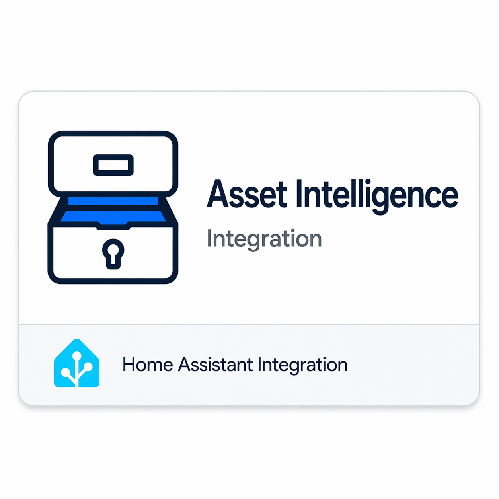
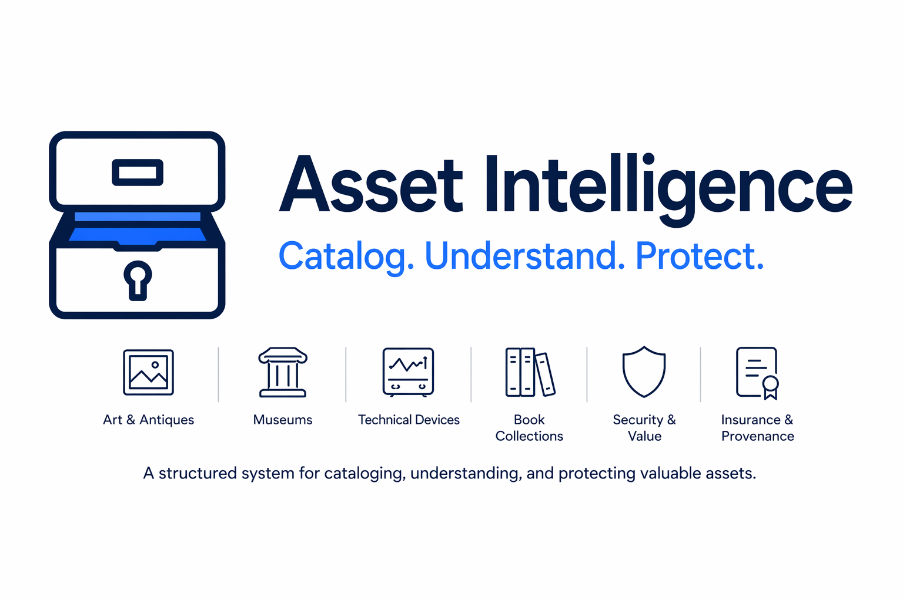

# Asset Intelligence

Asset Intelligence extends Home Assistant with an asset-centric model for environmental stewardship, provenance, and lifecycle tracking.

It helps you answer:

- Are room conditions appropriate for what is in this room?
- Is an asset currently at risk?
- Do I have the documents and history I need?

## Highlights

- Asset-aware risk and advisory evaluation
- Room-level environmental context and measurement history
- Document and provenance support
- Custody and movement tracking

## Images

## Documentation

- Wiki: https://github.com/tom-tagmdl/asset_intelligence/wiki
- Getting Started: https://github.com/tom-tagmdl/asset_intelligence/wiki/Getting-Started
- Troubleshooting: https://github.com/tom-tagmdl/asset_intelligence/wiki/Troubleshooting
